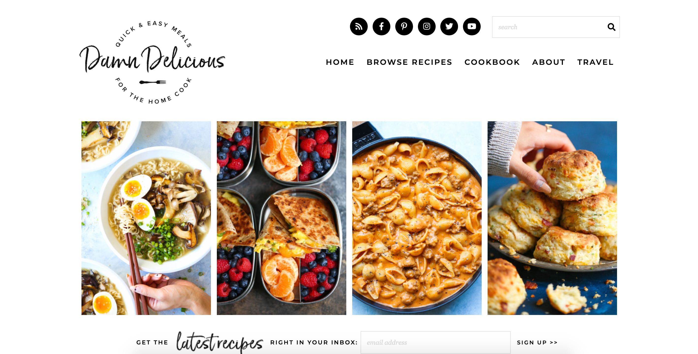

# Damn Delicious Clone

A clone of the food blog [Damn Delicious](https://damndelicious.net/).
This is a styling exercise.

Original:


Clone:


## Getting Started

To get a copy of the project up and running on your local machine, run this command and open the index.html file:

```
git clone https://github.com/justinh5/Damn-Delicious-Clone.git
```

### Requirements

Chrome, Firefox, IE, Safari

## Author

**Justin Haupt** - *Initial work*
